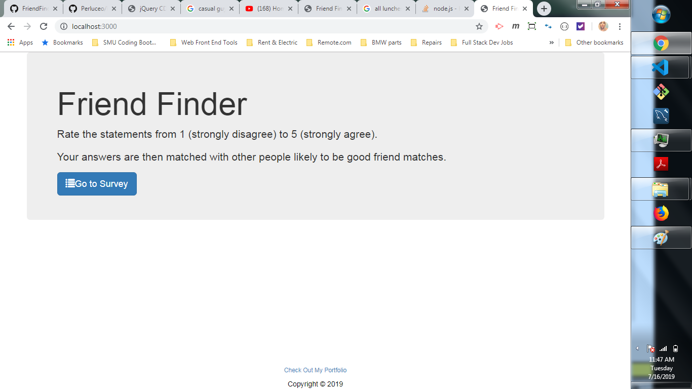
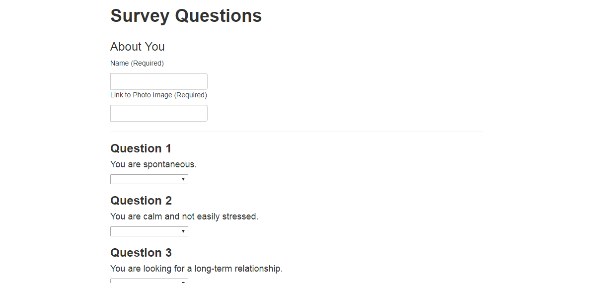
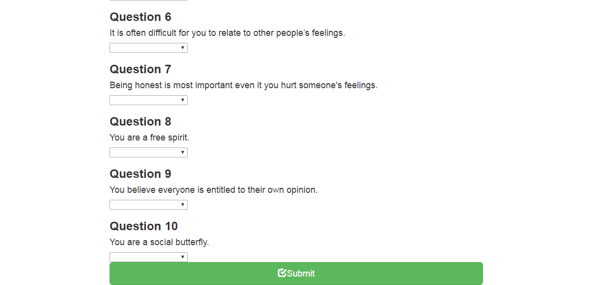
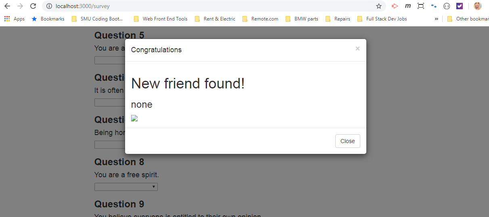

# FriendFinder

Compatibility-based "FriendFinder" application -- basically a dating app. This full-stack site will take in results from users' surveys, then compare their answers with those from other users. The app will then display the name and picture of the user with the best overall match.

Express will handle routing.

Currently the images and name of match is not populating but is still in refactoring stage.  Once results populate then app will be deployed to Heroku for other users to complete.

<h1>Technologies Used</h1>
<ul>
<li>Node</li>
<li>Express</li>
<li>Heroku</li>
<li>NPM packages Body Parser, Path, and Express
</ul>

<h2>Screenshots</h2>

home.html with button to route to survey.html

survey.html

submit button

Best Match Pop Up

